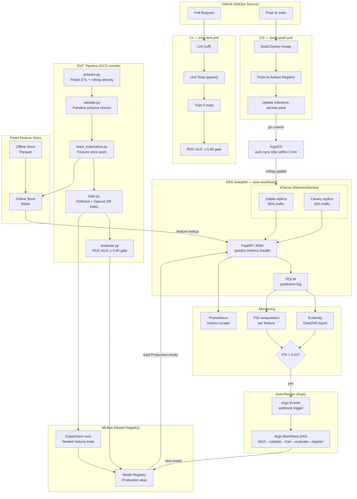

# MLOps Fraud Detection Platform on GKE

A production-grade MLOps platform for real-time credit card fraud detection, deployed on Google Kubernetes Engine (GKE). Built to demonstrate the full ML lifecycle — from raw data ingestion through automated retraining — using industry-standard open-source tooling.

## Architecture Overview



## Tech Stack

| Layer | Tool | Purpose |
|---|---|---|
| Data versioning | DVC 3.x + GCS | Reproducible data pipelines |
| Feature engineering | Polars 1.x | Lazy, columnar ETL + rolling velocity |
| Data validation | Pandera | Schema enforcement + dataset checks |
| Feature store | Feast | Offline (Parquet) + Online (Redis) |
| Training | XGBoost + Optuna | HPO with 50 Optuna trials, TPE sampler |
| Experiment tracking | MLflow | Nested runs, model registry, aliases |
| Serving | FastAPI + KServe | REST API with canary traffic splitting |
| Monitoring | Evidently + PSI | Data drift detection, Prometheus metrics |
| Orchestration | Argo Workflows | Retrain DAG triggered by drift events |
| Events | Argo Events | Webhook → WorkflowTemplate trigger |
| GitOps | ArgoCD | Auto-sync k8s/ manifests on image push |
| CI/CD | GitHub Actions | PR gate + build/push pipeline |
| Infrastructure | GKE Autopilot | Serverless Kubernetes, asia-southeast1 |

## Project Structure

```
mlops-fraud-gke/
├── src/
│   ├── features/
│   │   ├── prepare.py          # Polars ETL: rolling velocity, log-amount, z-score
│   │   ├── validate.py         # Pandera schema: 34 columns + dataset-level checks
│   │   ├── feast_materialize.py
│   │   └── feature_repo/       # Feast feature definitions + store config
│   ├── training/
│   │   ├── train.py            # XGBoost + Optuna + MLflow nested runs
│   │   ├── evaluate.py         # Load Production model, compute metrics
│   │   └── register.py         # Promote best model to Production alias
│   ├── serving/
│   │   ├── api.py              # FastAPI: /predict, /health, /ready, /metrics
│   │   └── model_loader.py     # Feature column order (34 features)
│   └── monitoring/
│       ├── drift_monitor.py    # Evidently DataDrift + PSI computation
│       └── prediction_logger.py # SQLite prediction log
├── pipelines/
│   ├── retrain-workflow.yaml   # Argo WorkflowTemplate DAG
│   ├── events/
│   │   ├── drift-event-source.yaml  # Argo EventSource (webhook :12000)
│   │   └── drift-sensor.yaml        # Argo Sensor → trigger WorkflowTemplate
│   └── test_retrain_local.sh   # Local simulation of retrain DAG
├── k8s/
│   ├── kserve/
│   │   └── inference-service.yaml  # KServe InferenceService (10% canary)
│   ├── argocd/
│   │   └── app.yaml            # ArgoCD Application + AppProject
│   └── monitoring/
│       └── drift-alert.yaml    # PrometheusRule for drift alerting
├── tests/
│   ├── unit/
│   │   ├── conftest.py         # 1100-row fixture (3.6% fraud rate)
│   │   ├── test_prepare.py     # 15 tests: features, rolling, splits
│   │   └── test_validate.py    # 5 tests: schema pass/fail cases
│   └── integration/
├── .github/workflows/
│   ├── train-test.yml          # PR: lint → unit tests → train (5 trials) → gate
│   └── build-push.yml          # main: build → push → update KServe manifest
├── dvc.yaml                    # 5-stage pipeline (prepare→validate→featurize→train→evaluate)
├── params.yaml                 # All tunable parameters
├── Makefile                    # Dev workflow shortcuts
├── Dockerfile                  # Multi-stage build for serving image
└── pyproject.toml              # Dependencies (uv)
```

## Quickstart (Local Development)

### Prerequisites

- Python 3.11+
- [uv](https://docs.astral.sh/uv/) — dependency manager
- [DVC](https://dvc.org/) installed in venv (not system snap — lacks GCS support)
- Kaggle API key (`~/.kaggle/kaggle.json`)
- GCP project with billing enabled

### 1. Install dependencies

```bash
uv sync --all-extras
# or: make install
```

### 2. Download the dataset

The model uses the [Kaggle Credit Card Fraud](https://www.kaggle.com/datasets/mlg-ulb/creditcardfraud) dataset (284,807 transactions, 0.17% fraud rate, PCA-anonymized V1–V28 features).

```bash
make data-download
```

### 3. Run the full DVC pipeline

```bash
make pipeline-run
# Runs: prepare → validate → featurize → train → evaluate
```

Or run individual stages:

```bash
.venv/bin/dvc repro prepare validate
```

### 4. Start MLflow and serve the model

```bash
# Terminal 1: MLflow tracking server
mlflow server \
  --backend-store-uri sqlite:///mlflow.db \
  --default-artifact-root ./mlruns \
  --host 0.0.0.0 --port 5000 &

# Terminal 2: Train
.venv/bin/python src/training/train.py

# Terminal 3: Register Production model
.venv/bin/python src/training/register.py

# Terminal 4: Serve
.venv/bin/uvicorn src.serving.api:app --host 0.0.0.0 --port 8080
```

### 5. Test the API

```bash
curl -s -X POST http://localhost:8080/predict \
  -H "Content-Type: application/json" \
  -d '{
    "transaction_id": "txn-001",
    "amount": 150.0,
    "hour_of_day": 14,
    "amount_log": 5.01,
    "amount_zscore": 0.3,
    "v_features": [0,0,0,0,0,0,0,0,0,0,0,0,0,0,0,0,0,0,0,0,0,0,0,0,0,0,0,0],
    "rolling_amount_1h": 300.0,
    "rolling_count_1h": 3
  }'
# → {"fraud_probability": 0.002, "is_fraud": false, "latency_ms": 5.6}
```

```bash
# Prometheus metrics
curl http://localhost:8080/metrics
```

### 6. Simulate retrain pipeline locally

```bash
bash pipelines/test_retrain_local.sh
```

## Key Design Decisions

### Feature Engineering

Two engineered features on top of raw PCA components:

| Feature | Description | Why |
|---|---|---|
| `rolling_amount_1h` | Total spend in past 1 hour (per card) | Velocity signal for card testing |
| `rolling_count_1h` | Transaction count in past 1 hour | Rapid small-charge pattern detection |
| `amount_log` | `log1p(amount)` | Normalize heavy-tailed spend distribution |
| `amount_zscore` | Z-score vs dataset mean/std | Outlier flagging without leaking labels |

### Model Training

- **Algorithm**: XGBoost with `scale_pos_weight` for class imbalance (1:578 ratio)
- **HPO**: Optuna TPE sampler, 50 trials, optimizes **PR-AUC** (not ROC-AUC — better metric for imbalanced data)
- **Validation**: 5-fold stratified cross-validation
- **Production gate**: ROC-AUC ≥ 0.90, PR-AUC ≥ 0.70

### Canary Deployment

New model versions get 10% traffic via KServe's `canaryTrafficPercent`. Promotion to 100% is a manual step (or automated based on error rate threshold `canary_error_rate: 0.01`).

### Drift Detection

Two complementary methods:

1. **PSI (Population Stability Index)** — per-feature binned distribution shift
   - `< 0.10`: stable
   - `0.10–0.20`: warn
   - `> 0.20`: trigger retrain via Argo Events webhook

2. **Evidently DataDriftPreset** — statistical tests per feature with `drift_share` summary

## CI/CD Workflows

### PR Gate (`train-test.yml`)

```
PR opened/updated
  → lint (ruff check + format)
  → unit tests (pytest tests/unit/)
  → train (5 Optuna trials, CI mode)
  → evaluate (ROC-AUC ≥ 0.85 gate)
  → comment metrics on PR
```

### Build & Deploy (`build-push.yml`)

```
push to main (src/ or Dockerfile changed)
  → build Docker image (linux/amd64)
  → push to Artifact Registry with git SHA tag
  → sed-update inference-service.yaml with new image
  → git commit + push (triggers ArgoCD)
  → ArgoCD auto-syncs within 3 min → KServe rolling update
```

## GKE Deployment

### Prerequisites

```bash
# 1. Set up GCP resources
make setup-gcp

# 2. Create GKE Autopilot cluster
make cluster-create

# 3. Install cluster add-ons (in order)
kubectl apply -f https://github.com/cert-manager/cert-manager/releases/latest/download/cert-manager.yaml
# Install KServe, Argo Workflows, Argo Events, ArgoCD via Helm
```

### Deploy ArgoCD application

```bash
kubectl apply -f k8s/argocd/app.yaml
# ArgoCD syncs k8s/ directory → creates InferenceService + monitoring resources
```

### GitHub Secrets required

| Secret | Value |
|---|---|
| `GCP_WORKLOAD_IDENTITY_PROVIDER` | Workload Identity pool provider resource name |
| `GCP_SERVICE_ACCOUNT` | Service account email with AR Writer + GCS roles |

## Model Performance

Results from local training run (10 Optuna trials on full Kaggle dataset):

| Metric | Value | Threshold |
|---|---|---|
| ROC-AUC | 0.9750 | ≥ 0.90 |
| F1-Score | 0.8587 | — |
| PR-AUC | ~0.80 | ≥ 0.70 |

> For portfolio-quality results, increase `n_trials` to 50 in `params.yaml`.

## Running Tests

```bash
make test          # all tests
make test-ci       # unit tests only (no GCP credentials needed)
make lint          # ruff check + format check
```

Current test coverage: **20 unit tests** across data preparation and schema validation.

## Configuration

All tunable parameters live in `params.yaml`:

```yaml
train:
  n_trials: 50          # Optuna trials (use 5 for CI speed)

thresholds:
  min_roc_auc: 0.90     # Production gate
  drift_psi_threshold: 0.20  # Retrain trigger

serving:
  fraud_threshold: 0.50 # P(fraud) > this → flag as fraud
```

## License

MIT
